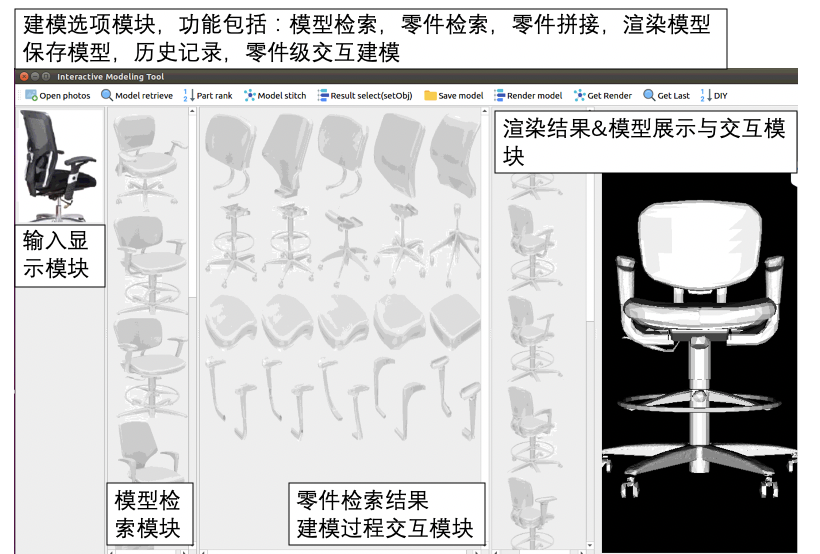

# 关于Y-y_x同学

这是Y-y_x同学的第一篇markdown博客，现在是5.2日0：42，明天还要开组会，不多写了

## 5.2日9:23
老师给了我2🌟，让我知道了错误，宁可不做，也要做好

## 自我介绍

我是Y-y_x，孤舟蓑笠翁。

在计算机专业不断摸索适合自己的道路，以及生活与工作的平衡。

我的爱好
1. 各种体育运动，最近较多的，足球、游泳、滑雪和健身。
2. 视频音频制作剪辑。
3. 商业金融


学过的编程语言有
* `C/C++、`
* `Java`
* `Python`
  
  
我写一段给你瞧瞧吧

```C++
while(true){
    if(alive){
        study();
        struggle();
        keepforward();
    }else{
        break;
    }  
}
return live;
```

这是最近的毕业设计的工作
> 毕设工具


还要赶6月的PG2020，现在做的和前端差别好大，忙里偷闲，学点前端，主要是急需获得反馈，毕竟科研反人类。

老师啊，我会的都用啦，给我个五星好评吧hhhh
